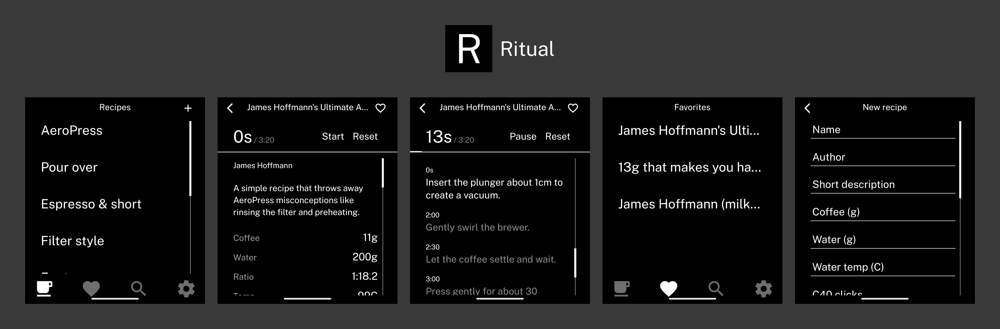

<p>An AeroPress recipe guide for the Light Phone III.</p>


> [!NOTE]
> Built for the minimal, greyscale screen of the Light Phone III. It runs as a standalone app with every recipe bundled in, so no account, network, or scale is required to brew.

## Installation

Download the latest APK from the [releases page](https://github.com/KEZO555/aeropress-light/releases/latest) and sideload it onto your Light Phone III.

I recommend using [Obtainium](https://github.com/ImranR98/Obtainium) to install and keep the app up to date directly from this repository.

## Features

- Browse recipes by category — espresso & short, V60 style, for two, quick, bold & dark, light & bright, or all
- Full brew specs: coffee, water, ratio, temperature, time, roast, grind, orientation, and Comandante C40 clicks
- Built-in brew timer that pins to the corner and auto-scrolls the steps to keep pace as you pour
- No-scale mode that translates each recipe into AeroPress scoops so you can brew without weighing

## Limitations

- The greyscale display has no color, so recipes are designed around contrast and typography rather than imagery
- Recipes are bundled at build time; new recipes arrive with app updates rather than over the network

## Greyscale Toggle

The Light Phone III renders everything in greyscale. To grant this app the secure-settings permission via adb:

```bash
adb shell pm grant com.vandam.aeropresslight android.permission.WRITE_SECURE_SETTINGS
```

## Development

See [AGENTS.md](./AGENTS.md) for the component reference, patterns, and build commands.
